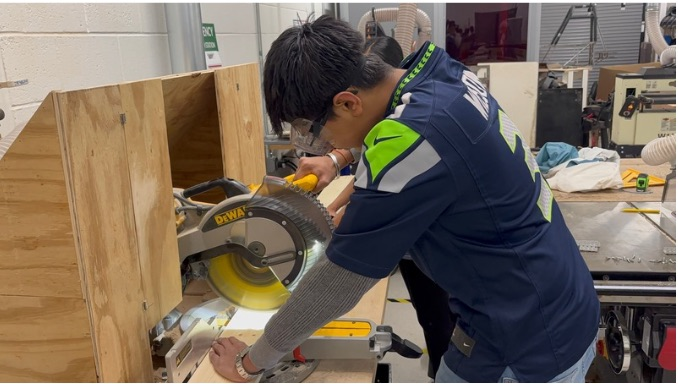

# Saksham Garg — Engineering Portfolio

A plain HTML / CSS / JavaScript website. No frameworks, no installs, no build step. It is hosted free on GitHub Pages.

- **Live site:** https://atlsaksham10.github.io/Portfolio/
- **Repo:** https://github.com/ATLSaksham10/Portfolio

This README is written so you can update every part of the site yourself, even with minimal coding experience. Find the section for what you want to change and follow the steps.

---

## Contents

1. [The 4-step update routine](#the-4-step-update-routine)
2. [Where does everything live?](#where-does-everything-live)
3. [Rules that prevent 90% of breakages](#rules-that-prevent-90-of-breakages)
4. [Add a new project](#add-a-new-project)
5. [Edit or remove an existing project](#edit-or-remove-an-existing-project)
6. [Add research or a publication](#add-research-or-a-publication)
7. [Add a flight to the drone log](#add-a-flight-to-the-drone-log)
8. [Add a Featured item](#add-a-featured-item-video-article-press-talk-award)
9. [Add a timeline entry (roles)](#add-a-timeline-entry-roles)
10. [Change name, tagline, bio, email, socials, hobbies, tools](#change-name-tagline-bio-email-socials-hobbies-tools)
11. [Photos and images](#photos-and-images)
12. [Resume](#resume)
13. [Publish your changes](#publish-your-changes)
14. [Troubleshooting](#troubleshooting)
15. [Technical notes](#technical-notes)

---

## The 4-step update routine

Every change follows the same four steps:

1. **Edit** the file(s) in this folder with any text editor (VS Code, TextEdit in plain-text mode, or Cursor).
2. **Check** it: double-click `index.html` to open the site in your browser and look at the page you changed. Use **Cmd + Shift + R** to force a fresh reload.
3. **Publish**: run the three git commands in [Publish your changes](#publish-your-changes).
4. **Wait ~1 minute**, then hard-refresh the live site.

> Tip: you can also paste the "intake form" from [Add a new project](#add-a-new-project) into Claude or Cursor and ask it to do the edits for you. This README tells you what it should be changing.

---

## Where does everything live?

| I want to change… | Edit this file |
|---|---|
| Name, tagline, email, social links, hobbies, tools list | `assets/js/data/site.js` |
| Home page timeline (roles and positions) | `assets/js/data/timeline.js` |
| The project cards on the Projects page | `assets/js/data/projects-data.js` |
| A single project's full page | `projects/<project-name>.html` |
| Research and publications | `assets/js/data/research-data.js` |
| Drone flight log | `assets/js/data/flights.js` |
| Featured (videos, press, awards, talks) | `assets/js/data/featured-data.js` |
| Home page intro text | `index.html` |
| About page text, photo gallery, captions | `about.html` |
| Resume | replace `assets/docs/resume.pdf` |
| Photos | put them in `photos/` (see [Photos](#photos-and-images)) |
| Colors, fonts, spacing | `assets/css/base.css` (colors and fonts are at the top) |

Everything in `assets/js/data/` is just lists of information. You never need to touch the other JavaScript files (`layout.js`, `main.js`, `home.js`, and so on) to update content.

---

## Rules that prevent 90% of breakages

When you edit the `.js` data files, these are the only things that can go wrong:

1. **Keep the quotes.** Text goes inside double quotes: `"like this"`.
2. **Quotes inside text need a backslash.** Writing `"A 5" quad"` breaks the file; write `"A 5\" quad"`. Apostrophes (`'`) are fine inside double quotes.
3. **Keep the commas.** Every item in a list needs a comma after it **except the last one**. Same for the lines inside `{ ... }`.
4. **Never delete** the `{`, `}`, `[`, `]`, or `;` that are already there.
5. **Copy an existing entry, paste it right below, and change only the text between quotes.** This is the safest way to add anything.
6. After saving, **open the page in your browser**. If a section is blank or missing, you probably broke rule 1, 2 or 3. Press **Cmd + Option + J** (Chrome) to see a red error message with the file name and line number.
7. **Never publish a pilot certificate number or your phone number** anywhere on the site.

---

## Add a new project

A project has two parts: **its own page** and **its card on the Projects page**. You need both.

### Step 0: Gather your info (the intake form)

Fill this in for each project. Anything you don't know, leave as `TODO` and don't invent it.

```
Project name:
Year / timeframe:
My role:
Team (if any):
Tools (Creo, Onshape, SimScale, etc.):
One-sentence summary (for the grid card):
Tags (e.g. CAD, CFD, FEA, Robotics):
Problem / goal:
What I did (approach, setup, design choices):
Results (real numbers only):
Key takeaways:
Links (video, GitHub, paper, etc.):
Photos (file name -> caption; which one is the hero image?):
```

### Step 1: Make the project's page

1. In the `projects/` folder, **copy** `TEMPLATE.html` and rename the copy to a short, lowercase name with dashes and no spaces, for example `solar-car-chassis.html`. This name is the project's **slug**.
2. Open your new file and replace everything marked `TODO:`. Search the file for `TODO` to find them all.
   - `<title>` and the two `og:` lines near the top (the title and description people see in Google and when the link is shared).
   - The header: year/type (the small line above the title), the title, and a one-line summary.
   - The **meta strip**: Role, Timeframe, Tools, Team.
   - The sections: **Overview, Problem, Approach, Results, Key takeaways**. Each is a `<p>…</p>` paragraph or a `<li>…</li>` bullet. Copy a line to add more, delete a line to remove it. Delete a whole `<section> … </section>` block if you don't need that section.
3. **Delete this line** near the top, or Google will not list the page:
   ```html
   <meta name="robots" content="noindex">
   ```
4. **Previous / Next buttons** at the bottom: change both `href="TODO-previous-slug.html"` and `href="TODO-next-slug.html"` to the file names of the neighboring projects. Delete the buttons if you don't want them.

> Easiest alternative: copy an existing finished project (for example `sunroom-design.html`) instead of `TEMPLATE.html`, and overwrite its text. The structure is the same.

**Results as big numbers.** The finished projects show the main numbers in boxes. To copy the style, put this inside the Results section:

```html
<div class="stats-row stats-row--3" style="margin:1.25rem 0">
  <div class="stat"><div class="stat-value">+140%</div><div class="stat-label">Feed capacity</div></div>
  <div class="stat"><div class="stat-value">~84%</div><div class="stat-label">Longer part life</div></div>
  <div class="stat"><div class="stat-value">+10%</div><div class="stat-label">Operator efficiency</div></div>
</div>
```

Change `stats-row--3` to `--2` or `--4` to match the number of boxes.

### Step 2: Add the card to the Projects page

Open `assets/js/data/projects-data.js`. The cards appear **in the order listed**, so list your most important project first. Copy one block, paste it where you want the card to appear, and edit it:

```js
{
  slug: "solar-car-chassis",
  title: "Solar car chassis",
  year: "2026",
  tags: ["CAD", "FEA"],
  blurb: "One sentence that sells the project.",
  image: "photos/solar-hero.jpg",
  href: "projects/solar-car-chassis.html"
},
```

- `slug` and `href` must match your page's file name.
- `tags` become the filter buttons on the Projects page. Reuse existing tags where you can (CAD, CFD, FEA, Robotics…) and keep the list short, because every different tag adds another button.
- `image` is the card photo. Use `"assets/img/placeholder.svg"` until you have a real photo, or point it at a file in `photos/`, e.g. `"photos/solar-hero.jpg"`.
- The last entry, `slug: "coming-soon"`, is the "Coming soon" placeholder card. Keep it **last** (paste new projects above it), or delete the whole block if you don't want it.
- The "Projects" count on the home page updates by itself.

### Step 3 (optional): Add a photo, links, or a video to the project page

Everything below goes in the project's `.html` file.

**Hero (banner) photo.** The project pages ship with a plain dark header. To add a photo, put this between the two lines `<div class="project-header-media">` and the `</div>` right after it:

```html

```

(Note the `../` at the start. Pages inside `projects/` always need it.)

**A figure with a caption** (for simulation images, CAD screenshots, and so on). Paste inside the Results section:

```html
<figure class="figure-block">
  
  <figcaption>What the viewer should notice in this image.</figcaption>
</figure>
```

**A photo gallery.**

```html
<section class="section" style="padding-top:0">
  <div class="wrap">
    <h2>Gallery</h2>
    <div class="gallery-grid">
      
      
    </div>
  </div>
</section>
```

**Link buttons and a YouTube embed.** Near the bottom of each project page there is a commented-out `Links` block. To turn it on, delete the `<!--` line at the start and the `-->` at the end, then fill in the URLs:

```html
<h2>Links</h2>
<div class="tag-row"><a class="btn" href="https://github.com/you/repo">GitHub repo</a></div>
<div class="video-embed"><iframe src="https://www.youtube.com/embed/VIDEO_ID" title="Video title" loading="lazy" allowfullscreen></iframe></div>
```

For YouTube, use the **embed** form: take the part after `v=` in the normal link and put it after `/embed/`. For example, `youtube.com/watch?v=abc123` becomes `youtube.com/embed/abc123`.

---

## Edit or remove an existing project

- **Edit the text:** open `projects/<name>.html` and change the words. For the card text, edit its block in `projects-data.js`.
- **Remove a project:**
  1. Delete its block from `projects-data.js`.
  2. Delete the file `projects/<name>.html`.
  3. Fix the Previous/Next buttons on the project pages next to it, so none point at the deleted file.
  4. Remove it from `timeline.js` if it is linked there.
- **Reorder projects:** move the blocks up or down in `projects-data.js`. Keep a comma after each block except the last one.

---

## Add research or a publication

Open `assets/js/data/research-data.js`, copy an existing block and edit it. Papers with `status: "Published"` always appear first. Research cards live **only** on the Research page, not on the Projects page.

```js
{
  type: "Journal paper",            // shown as a small label, e.g. "Journal paper", "AP Research", "Poster"
  title: "Full paper title",
  venue: "AIAA Journal",            // journal or conference
  year: "2026",
  role: "Co-author",
  topic: "One-line topic",
  tags: ["UAM", "Aerospace"],       // optional
  abstract: "Two or three sentences.",
  details: [                        // optional: extra labeled sections shown when the card is expanded
    { label: "Method", text: "How it was done." },
    { label: "Findings", text: "What was found." }
  ],
  status: "Published",              // "Published" or "In progress"
  links: [                          // buttons at the bottom; use [] if there are none yet
    { label: "Read paper", href: "https://doi.org/..." },
    { label: "PDF", href: "assets/docs/my-paper.pdf" }
  ]
}
```

- `tags`, `details` and `links` are optional. You can delete those lines entirely.
- To host a PDF yourself, put it in `assets/docs/` and link to it as shown above.
- The "Publications" count on the home page counts entries whose status is exactly `"Published"`.
- When the AP Research project finishes, change `status` to `"Published"` (or leave it "In progress"), change the "(planned)" labels to past tense, and add the results.

---

## Add a flight to the drone log

Open `assets/js/data/flights.js` and scroll to the bottom. Add a new `flight(...)` line **inside** the `DRONE.flights.push( ... );` block, with a comma after every flight except the last one:

```js
flight("2026-09-12", "Alpharetta, GA", "Real estate photos", 25, "approved", {
  drone: "DJI Mini 4 Pro",
  airspace: "Class D",
  altFt: 250,
  authId: "LAANC authorization ID"
}),
```

What each piece means, in order:

| Piece | Meaning |
|---|---|
| `"2026-09-12"` | Date, **always** `YYYY-MM-DD` |
| `"Alpharetta, GA"` | Location |
| `"Real estate photos"` | Purpose |
| `25` | Minutes flown (a number, no quotes) |
| `"approved"` | LAANC status: exactly `"approved"`, `"not-needed"` or `"denied"` |
| `{ ... }` | Optional extras: `drone`, `airspace`, `altFt`, `authId`, `notes` |

If there are no extras, leave the braces off: `flight("2026-09-12", "Place", "Purpose", 25, "not-needed"),`.

- The order of the lines doesn't matter, because the page sorts newest first.
- Set your drone's name once in `defaults` at the top of the file (`drone: "DJI Mini 4 Pro"`). Then you only add `drone:` to a flight when it used a different drone.
- The four stat boxes (flights, hours, locations, approvals) on the Drone page, and the flight count and hours on the home page, are **calculated from this list**.
- **Right now the file still has 5 placeholder flights marked `TODO`.** Delete those 5 blocks and add your real ones, or the site shows made-up flight data.
- Do **not** put your pilot certificate number anywhere.

---

## Add a Featured item (video, article, press, talk, award)

Open `assets/js/data/featured-data.js`, copy a block, and edit it:

```js
{
  type: "award",                        // exactly one of: video, article, press, talk, award
  title: "Name of the award or article",
  outlet: "Who gave or published it",
  date: "2026-04-18",                   // always YYYY-MM-DD; newest shows first
  url: "https://link-to-it.com",
  thumb: "assets/img/placeholder.svg",  // or a real image, e.g. "photos/my-award.jpg"
  blurb: "One short line."
},
```

The filter buttons on the Featured page are created automatically from the `type` values you use. The five placeholder entries are still there marked `TODO`. Replace them with real items, or delete them.

---

## Add a timeline entry (roles)

The home page timeline is for **roles and positions** (internships, captain roles, and so on). It is not for projects. Open `assets/js/data/timeline.js`, copy a block, and paste it in the right place. The list is **newest first**.

```js
{
  id: "swagelok-intern",             // any unique name, no spaces
  dateLabel: "Aug 2026 – Present",
  title: "Engineering Intern",
  org: "Swagelok Georgia",
  location: "Alpharetta, GA",
  summary: "One or two sentences.",
  href: "projects/caterpillar-wire-feed.html"   // OPTIONAL: adds a "View project" button. Delete the line if there is no page.
},
```

If you add an `href`, remember to remove the comma from the entry **before** it if it was the last one, and keep the commas between the others.

---

## Change name, tagline, bio, email, socials, hobbies, tools

**`assets/js/data/site.js`** controls:

- `name` and `fullName`: name shown in the nav, footer and hero.
- `tagline`: the line under your name on the home page and footer.
- `email`: stored in two pieces so spam bots can't easily scrape it. For `you@gmail.com`, write `{ user: "you", domain: "gmail.com" }`. Don't paste a raw `mailto:` link anywhere in the HTML.
- `socials`: the Instagram, LinkedIn and GitHub links.
- `hobbies`: the three cards on the About page (`label` + `note`).
- `tools`: the tag list on the About page and under your bio on the home page.

**Home page intro text** is in `index.html`. Search for `<p class="eyebrow">Intro</p>` and edit the `<p>…</p>` paragraphs right below it.

**About page text** is in `about.html`, near the top. Edit the `<p>…</p>` paragraphs.

---

## Photos and images

### Where to put them

```
photos/                        ALL your pictures go here, flat (no sub-folders)
assets/img/placeholder.svg     the gray stand-in image (leave it)

`photos/README.md` lists every file name the site expects (portrait.jpg,
about-1.jpg ... about-6.jpg, cat-hero.jpg, frc-hero.jpg, and so on). To swap a photo,
save the new one over the old file with the same name. Missing photos are skipped or
replaced by the gray placeholder. Gallery photos keep their own shape (tall or wide).
```

Create the folders if they don't exist.

### Prepare them

- **File names:** lowercase, dashes, no spaces. Describe the photo: `sunroom-design-onshape-model.webp`, not `IMG_4021.HEIC`.
- **Size:** hero (banner) images up to **2000 px** wide, everything else up to **1200 px**. Aim for **under 300 KB** each. Big photos are the #1 reason sites feel slow.
- **Format:** WebP (smallest) or JPG. Convert iPhone HEIC photos.
- **Easy way:** drag the photo into https://squoosh.app, choose WebP, and download.
- **Mac Terminal way** (resizes to 1600 px wide and saves a JPG):
  ```bash
  sips -Z 1600 -s format jpeg -s formatOptions 80 "input.HEIC" --out output.jpg
  ```
- Never upload photos of other people (especially minors), license plates, or anything confidential (for example, Caterpillar or Swagelok internals) unless you have permission.

### Use them

- **Project card photo:** set `image:` in `projects-data.js`.
- **Project page photos:** see [Step 3](#step-3-optional-add-a-photo-links-or-a-video-to-the-project-page).
- **Home and About portrait:** in `index.html` and `about.html`, find the line with `portrait of Saksham Garg`, and change `src` to your file, e.g. `src="photos/portrait.jpg"` (already set up: just save your portrait as `photos/portrait.jpg`). Update the `alt="…"` text to describe the photo.
- **About gallery:** `about.html` has 6 blocks like this. Change the `src`, `alt` and the caption:
  ```html
  <button type="button" data-photo>
    
    <span class="cap">Welding the bumper bracket</span>
  </button>
  ```
  Copy a whole `<button>…</button>` block to add more photos, or delete one to remove it. Clicking a photo opens it larger.
- **`alt` text** is a short description of the photo for screen readers and Google. Always fill it in.
- **Share preview image:** when someone shares your link, the preview image comes from the `og:image` line near the top of each page. A 1200×630 JPG or PNG works best (SVG files are ignored by many sites). Save it as `photos/social-preview.jpg`. Every page's `og:image` line already points at it.

---

## Resume

Save your PDF as exactly **`assets/docs/resume.pdf`**. Replacing the file updates every Resume button on the site (nav, footer, About). Before you publish it, check that it contains nothing you don't want public: your phone number, home address and similar. Anything in that PDF is downloadable by anyone.

---

## Publish your changes

Open Terminal and run these three commands, one at a time:

```bash
cd ~/Downloads/"GitHub stuff"/"Personal Portfolio Website 0.1"
```

```bash
git add .
```

```bash
git commit -m "Describe what you changed"
```

```bash
git push
```

(Or use GitHub Desktop: write a summary, **Commit to main**, then **Push origin**.)

Then wait about a minute and hard-refresh the live site with **Cmd + Shift + R**. GitHub Pages tells browsers to remember files for up to 10 minutes, so an old version can linger.

---

## Troubleshooting

| Problem | Likely cause and fix |
|---|---|
| A page or section is blank or missing | A typo in a `.js` data file: a missing comma, quote or bracket. Open the browser console (Cmd + Option + J) and read the red error. It names the file and line. |
| My change doesn't show on the live site | Hard-refresh (Cmd + Shift + R). Make sure you ran `git push` and that it didn't show an error. Check the repo's **Actions** tab on GitHub. |
| Image doesn't appear | Check the spelling and capitalization of the file name (`Photo.JPG` is not `photo.jpg`). On project pages the path must start with `../`. |
| Project card does nothing when clicked | Its `href` in `projects-data.js` doesn't match the page's file name. |
| Resume button shows "404" | `assets/docs/resume.pdf` is missing or named differently. |
| Page title says "TODO" in the browser tab | Edit the `<title>` line near the top of that HTML file. |
| Stats on the home page look wrong | They come from `flights.js` (flights, hours), `projects-data.js` (projects) and `research-data.js` (publications). Fix the data, not the page. |
| I want to undo a bad change | Run `git restore <file>` to bring back the last saved version of one file, or ask for help before using any other undo command. |

**Find everything still unfinished:**

```bash
grep -rn "TODO" . --include="*.html" --include="*.js"
```

---

## Technical notes

- Every page's `<body>` has `data-root=""` (or `"../"` for pages inside `projects/`). This tells the shared navigation which folder to link from. Don't change it.
- The nav and footer are built by `assets/js/layout.js` from `site.js`, so changing the nav in one place changes every page.
- The data files are plain scripts that set `window.SITE`, `window.PROJECTS`, `window.RESEARCH`, `window.TIMELINE`, `window.FEATURED` and `window.DRONE`. There is no `fetch` and no ES modules, so the site also works when opened straight from disk.
- Scroll feel is controlled by flags at the top of `assets/js/main.js` (`USE_LENIS`, `HERO_PIN`, `HERO_PIN_LENGTH`, `PROJECT_PARALLAX`). Native scrolling is the default for speed.
- Animations only use `transform` and `opacity`, and respect the visitor's reduced-motion setting. If GSAP or Lenis fail to load, the site is still fully readable.
- Script load order on every page (all `defer`): GSAP, ScrollTrigger, Lenis 1.1.18, data files, `layout.js`, `main.js`, then the page's own script.
- `.nojekyll` stops GitHub from processing files through Jekyll. Leave it in place.
- To preview locally with correct paths: run `python3 -m http.server 8080` in this folder, then visit http://localhost:8080.

### Deploying from scratch

1. Push this repo to GitHub.
2. Repo **Settings → Pages**.
3. Source: **Deploy from a branch**, Branch: `main`, folder: `/ (root)`.
4. Save. The site appears at `https://<user>.github.io/<repo>/`.
